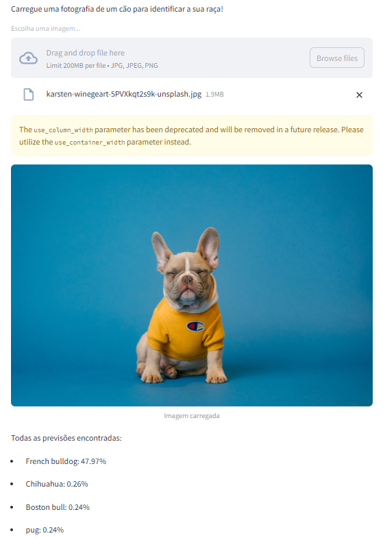

# 🐕 Identificador de Raças de Cães

Esta aplicação utiliza Inteligência Artificial para identificar raças de cães em imagens. Utilizando deep learning (ResNet50) e uma interface amigável, o sistema permite que os utilizadores carreguem fotografias de cães e recebam previsões sobre a raça do animal.



## 📋 Pré-requisitos

Antes de começar, necessita de ter instalado no seu computador:

- Python 3.10 ou superior
- Git (opcional, para clonar o repositório)

## 🚀 Instalação

### 1. Clone o repositório (ou transfira o ZIP)
```bash
git clone https://github.com/misterdatatica10/Detetar_Racas_Caes.git
cd Detetar_Racas_Caes
```

### 2. Crie um ambiente virtual
```bash
# Windows
python -m venv venv
.\venv\Scripts\activate

# Linux/Mac
python3 -m venv venv
source venv/bin/activate
```

### 3. Instale as dependências
```bash
pip install -r requirements.txt
```

## 💻 Como Utilizar

1. Ative o ambiente virtual (se ainda não estiver ativo):
```bash
# Windows
.\venv\Scripts\activate

# Linux/Mac
source venv/bin/activate
```

2. Execute a aplicação:
```bash
streamlit run app.py
```

3. Abra o seu navegador no endereço indicado (geralmente http://localhost:8501)

4. Utilize a interface para:
   - Carregar uma imagem de um cão
   - Visualizar as previsões de raça
   - Ver a percentagem de certeza para cada previsão

## 📸 Dicas para Melhores Resultados

Para obter os melhores resultados:
- Utilize imagens bem iluminadas
- Certifique-se de que o cão está de frente para a câmara
- Evite imagens muito escuras ou desfocadas
- O focinho do cão deve estar visível na fotografia
- Formatos suportados: JPG, JPEG, PNG

## 🛠️ Tecnologias Utilizadas

- [Python](https://python.org) - Linguagem de programação
- [Streamlit](https://streamlit.io) - Framework para a interface web
- [PyTorch](https://pytorch.org) - Framework de deep learning
- [ResNet50](https://pytorch.org/vision/stable/models.html) - Modelo de rede neuronal pré-treinado

## ⚠️ Limitações Conhecidas

- O modelo pode ter dificuldade com:
  - Imagens muito escuras ou desfocadas
  - Cães em posições não convencionais
  - Raças muito raras ou mistas
  - Imagens com múltiplos cães 